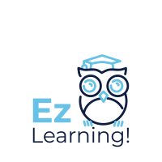

# Informe técnico

{width='100px'}

### Modelos de ejecución
Aunque hay varios tipos de modelos de ejecución cliente/servidor, hay dos que destacan por encima de los demás y son los más utilizados: el modelo **Cliente/Cervidor Clásico** y el modelo **Peer-to-Peer (P2P)**.
El **modelo Cliente/Servidor clásico** es una arquitectura centralizada en la que el servidor se encarga de gestionar los recursos, guarda los datos y procesa las solicitudes, mientras que el cliente solo se encarga de realizar solicitudes al servidor. En este modelo el servidor es más poderoso y los clientes solo pueden consumir los recursos que este gestiona, lo que hace que sea el modelo más seguro de los dos ya que solo se ha de aplicar los métodos de seguridad en el servidor central para proteger los datos de la aplicación. Debido a la centralización del servidor, este modelo conlleva algunas desventajas como, por ejemplo, que si falla el servidor los clientes no pueden acceder a los recursos y también se pueden dar cuellos de botella si demasiados clientes intentan acceder al servidor a la vez. Un ejemplo de este modelo sería una aplicación web en la que un navegador solicita una página web al servidor, al que este le devuelve con los datos (en este caso el cliente sería el navegador mientras que el servidor podría ser un servidor web de Apache o Nginx).
De este modelo hay varios subtipos, pero los más relevantes son los siguientes: 

El modelo de dos capas (2-tier) es el más simple de los modelos cliente/servidor. Aquí, el cliente se comunica directamente con el servidor, el cual gestiona los datos y la lógica de negocio. Este modelo es común en aplicaciones pequeñas, pero no es escalable para grandes sistemas, ya que a medida que aumentan los usuarios, el servidor puede sobrecargarse fácilmente.

El modelo de tres capas (3-tier) separa la arquitectura en tres partes: la capa de presentación (cliente), la capa de lógica de negocio (servidor de aplicaciones), y la capa de datos (servidor de bases de datos). Esto mejora la organización y la escalabilidad de las aplicaciones, ya que cada capa se puede gestionar y escalar de manera independiente. Es común en aplicaciones empresariales donde se requiere una clara separación entre las responsabilidades del cliente y del servidor.

En el caso del **modelo Peer-to-Peer (P2P)** no existe un servidor central. Cada nodo (peer) es cliente y servidor simultáneamente, compartiendo recursos directamente con otros nodos de la red haciendo que no deban depender de una entidad central. De esta forma, al no haber un punto único de fallo se fortalece la resilencia de la red haciendo que sea más difícil que deje de funcionar y gracias a que no requiere una infraestructura costosa es más asequible de precio. Sin embargo, que no esté centralizada conlleva que la seguridad de los datos que se transmiten sean más inseguros y es más dificil aplicar políticas de control o supervisar a todos los nodos. Una aplicacion Peer-To-Peer muy conocida es BitTorrent, en la que los usuarios descargan archivos dividiéndolos en fragmentos pequeños, que luego se distribuyen entre diferentes nodos de la red.

**Ez Learning** será desarrollada en base al modelo **Cliente/Cervidor Clásico de dos capas**, ya que como la aplicación será pequeña y destinada a una clase, es decir, pocos usuarios, las ventajas y la forma de centralizar los datos es lo que más se adecúa a lo que se quiere lograr.

### Lenguajes de Programación web
Como se ha indicado en el [documento de presentación](https://github.com/Jaregonz/P1_RegueraGonzalezJacinto_DWEC/blob/main/Documento_Presentacion_Proyecto1.md), la aplicación utilizará en su front el lenguaje _JavaScript_. _JavaScript_ es un lenguaje de programación que los desarrolladores utilizan para hacer páginas web interactivas considerandose una de las principales tecnologías de las webs.
_JavaScript_ se considera como un lenguaje de _scripting_ o interpretado ya que se ejecuta en el navegador del cliente gracias a los motores de _JavaScript_ que estos suele traer incorporados y esto hace que se acelere la ejecución de código y del sitio web ya que se reduce la carga en el servidor. Además gracias a este lenguaje se pueden crear páginas webs dinámicas y al ser un lenguaje asíncrono permite la ejecución de múltiples tareas sin bloquear la ejecución principal del programa. No obstante, _JavaScript_ tiene algunos inconvenientes a la hora de su uso, ya que aunque sea compatible con la mayoría de lenguajes de programación, hay diferecias respecto al soporte del navegador por eso hay veces en las que los navegadores lo interpretan de forma diferente, cosa que está siendo arreglada con cada actualización del lenguaje. Además, dado a que se relaciona con elementos como HTML, muchas veces hay problemas con la depuración y la localización sencilla de errores en los programas de código. Finalmente otra gran desventaja que contiene es su seguridad, ya que como el código se ejecuta directamente en el navegador si es una amenaza común los scripts maliciosos, por lo que siempre hay que asegurarse se porteger bien el código.

Como se ha mencionado anteriormente, _JavaScript_ permite el desarrollo de aplicaciones web dinámicas que se adaptan al usuario. Esto es fundamental para la aplicación _EzLearning_ ya que cada usuario tendrá la aplicación adaptada a su nivel de inglés. Además al no tener clara la cantidad de usuarios que van a hacer uso de la aplicación, siempre viene bien asegurar que el rendimiento y la ejecución del sitio web sea el más óptimo lo que hace que _JavaScript_ sea ideal para nuestra aplicación.
En backend, se va a ultilizar el framework de _Springboot_ como tecnología de desarrollo. Consecuentemente se usará _Java_ como lenguaje de back.
_Java_ es un lenguaje de programación multiplataforma orientado a objetos que se ejecuta en miles de millones de dispositivos de todo el mundo y es considerado el lenguaje de programación más popular en el mercado. Este lenguaje tiene varias ventajas a parte de ser multiplataforma y ser orientado a objetos, como por ejemplo su seguridad ya que posee mecanismos de seguridad integrados como el control de acceso mediante modificadores.Sin embargo, _Java_ tiene un inconveniente y es que su rendimiento es menor y tiene mayor consumo de memoria que otros lenguajes de programación.
A pesar de estos invonvenientes, _Java_ sigue siendo idóneo para _Ez Learning_ puesto que si se quiere llegar al mayor número de público posible, es fundamental contar con un lenguaje que se pueda adaptar al máximo número de dispositivos posible.

### Estudio sobre la compatibilidad en navegadores y compatibilidad de los lenguajes de marcas.
Los navegadores pueden manejar JavaScript y otros lenguajes de manera diferente, afectando tanto la compatibilidad como el rendimiento de las aplicaciones web. Esto es debido a que cada navegador usa un motor de _JavaScript_ diferente, siendo algunes de estos _V8_ (Google Chrome), _SpiderMonkey_ (Firefox), _Nitro_ (Safari) y _ChakraCore_ (Microsoft Edge). Aunque todos siguen el mismo estándar (ECMAScript(ECMA-262)), hay diferencias que pueden causar conflictos de compatibilidad como por ejemplo, que no todos los navegadores implementan nuevas APIs o métodos (sobre todo en navegadores más antiguos), pero la causa principal de estos conflictos es que cada motor optimiza de forma diferente. 
Por ejemplo, _V8_ es el más rápido de todos ya que compila todo el código _JavaScript_ a código máquina mientras que, por ejemplo, _SpiderMonkey_ compila a código byte lo que hace que sea un poco más lento. Es verdad que para este último problema no existe una solución definitiva, sin embargo, para el problema de las APIs existen algunas soluciones que podrían facilitar la compatibilidad entre nuevos y viejos navegadores, como la herramienta Babel que permite transformar código escrito con las últimas y novedosas características de JavaScript y transformarlo en un código que sea entendido por navegadores más antiguos. Dicho esto, como _Ez Learning_ estará desarrollada con _JavaScript_ hay que mantener en mente que hay que hacerlo lo más compatible posible con todo tipo de navegadores, así que habría que aplicar el uso de _Babel_ en la aplicación.

En lo referente a la compatibilidad de los lenguajes de marcas, aunque HTML y CSS están estandarizados, los navegadores no los manejan de manera idéntica, lo que genera varios problemas de compatibilidad. Un ejemplo común es el uso de prefijos específicos para ciertas características de CSS, como -webkit- para Chrome y Safari, -moz- para Firefox, y -ms- para versiones antiguas de Internet Explorer. No obstante existen varias herramientas que facilitan la compatibilidad del lenguaje de marcas entre los diferentes navegadores. Un ejemplo de ello es la librería de _JavaScript_ llamada **Modernizr**, que detecta las características soportadas por el navegador y aplican soluciones alternativas si es necesario.

En conclusión, para garantizar que una _Ez Learning_ funcione de manera óptima en diferentes navegadores, será fundamental hacer uso de herramientas como Babel, y Modernizr.

### Tecnológias a utilizar
En este apartado se entrará más en profundidad en las tecnologías que se van a usar para el desarrollo de _Ez Learning_, de las cuales algunas han sido mencionadas en apartado anteriores. Primero empecemos con las herramientas de programación web.

##### Frameworks
* **Springboot** : Como se ha ido mencionando a lo largo de ambos documentos _Springboot_ es el framework seleccionado para la parte de backend de nuestra aplicación. _Spring_ es un popular framework empresarial de código abierto que sirve para crear aplicaciones autónomas de producción que se ejecutan en una máquina virtual Java (JVM). Gracias a sus tres funciones principales (configuración automática, enfoque de configuración obstinado y su capacidad de crear aplicaciones autónomas), _Springboot_ es una herramienta que acelera y simplifica el desarrollo de microservicios y aplicaciones web con el framework de _Spring_. _Springboot_ es una poderosa herramienta que gracias a su enfoque en simplificar y facilitar el uso de _Spring_, su configuración automática y, sobre todo, su fácil integración con otras tecnologías harán que sea el framework idóneo para el desarrollo de la aplicación.

##### Librerías
* **React** : React es una librería para crear interfaces de usuarios con código abierto, es decir, que está a disposición de cualquier programador. Fue desarrollada por Facebook y su base es _JavaScript_. La función principal de React es desarrollar páginas web de una manera sencilla gracias a sus componentes reutilizables. Estos hacen posible usar un mismo elemento en varias partes del sitio o en otros sitios sin necesidad de volver a escribir todo el código. Gracias a esto, a la mejora de rendimiento con el Virtual DOM, y su flexibilidad para integrarse con otras herramienta hacen de React la librería idónea para el front de _Ez Learning_

* **Modernizr** : Como ya se ha mencionado anteriormente, Modernizr es una librería javascript que nos permite enfocar el diseño de nuestras páginas web a las capacidades del navegador.Su principal función es ayudar a los desarrolladores web a implementar técnicas de compatibilidad progresiva, asegurándose de que las aplicaciones funcionen de manera óptima en una amplia gama de navegadores, incluidos los más antiguo. _Ez Learning_ busca ser compatible con la mayor cantidad de usuarios posible, lo que hace que Modernizr sea indispensable.

* **Babel** : Babel es un transpilador de JavaScript que permite utilizar las últimas versiones de JavaScript y tranformar el código a una versión más antigua para que sea compatible con una mayor cantidad de navegadores. Esto lo realiza gracias a transformaciones de sintaxis y código fuente. Como queremos que la aplicación tenga el menor número de incompatibilidades posible, y gracias a Babel podremos reducir el número de navegadores incompatibles.

##### Editores de código
* **IntelliJ IDEA Community Edition 2024.2.1** : IntelliJ será el editor de código que usaremos para programar. Como el lenguaje que se va a a utilizar en el desarrollo backend es _Java_ y como también se usará _JavaScrpt_ para el front, IntelliJ es el editor idóneo puesto que aunque  está optimizado para _Java_, ofrece un soporte robusto para muchos otros lenguajes de programación populares, y JavaScript está entre ellos. Además facilitará el desarrollo gracias a sus diversas herramientas, como sus avanzada depuración  y su eficaz refactorización, y a su alta compatibilidad con los _frameworks_ más populares, entre los que se encuentra _Springboot_ y _React_.

* **Visual Studio Code** : Visual Studio será el editor usado para la parte de lenguaje de marcas. Visual Studio Code, también llamado  VSCode, es un editor de código desarrollado por Microsoft gratuito, de código abierto y multiplataforma. Gracias al uso de extensiones puede funcionar case al nivel de un IDE (entorno de desarrollo). VSCode ha sido elegido para el desarrollo de la parte de lenguaje de marcas de _Ez Learning_ ya que gracias al uso de extensiones como _HTML Snippet_, que proporciona fragmentos de HTML listos para usar, y _Auto Close Tag_/_Auto Rename Tag_, que permiten el cierre automático de etiquetas y renombrarlas de forma fácil, será mucho más sencillo llevar a cabo el desarrollo de la parte front relacionada con el lenguaje de marcas.

### 

### Análisis de mercado
El mercado de idiomas, particularmente el inglés, ha experimentado un crecimiento exponencial en los últimos años. Esto ha sido debido a la globalización y a la necesidad de aprender nuevos lenguajes en el ámbito laboral. Se estima que el mercado global experimente una enorme expansión, llegando a  los 36.400,33 millones de dólares, lo que hace que se pueda considerar un sector en expansión.
_Ez Learning_ está destinada para cualquier persona que quiera mejorar su nivel de inglés, sin embargo, el sistema de niveles haría que fuera más indicada para aquellos usuarios que se hallen preparándose para los exámenes de certificados de inglés. Está pensada con los profesores de academias de certificación en mente, puesto que ellos son los que usarán esta web como herramienta para sus clases.
El mercado está dominado por varias plataformas consolidadas que ofrecen soluciones innovadoras y diversas. Duolingo es quizás el ejemplo más conocido. Con más de 500 millones de descargas, esta plataforma ha ganado popularidad gracias a su enfoque basado en la gamificación y la simplicidad de sus lecciones. Otras plataformas muy conocidas en el mercado en el que competirían _Ez Learning_  son _Preply_ y _English Live_, que son plataformas orientadas a ofrecer clases en línea.
Aunque es cierto que el mercado de aplicaciones para aprender idiomas está saturado, es menor el número de aplicaciones que te permiten poder entrenar tus habilidades del idioma específicamente de cara a presentarte a exámenes de certificados de inglés, siendo este concretamente el principal objetivo de nuestro sistema. Al estar pensada para ser una herramienta para clases de inglés, esto atraerá a un nicho concreto lo que permitirá diferenciar la aplicación de las demás.

# Bibliografía

### Información sobre los modelos de ejecución cliente/servidor
https://www.arsys.es/blog/todo-sobre-la-arquitectura-cliente-servidor
https://www.cyberclick.es/numerical-blog/modelo-peer-to-peer-que-es-ventajas-y-ejemplos-de-exito

### Información sobre Springboot
https://www.ibm.com/es-es/topics/java-spring-boot
https://spring.io/projects/spring-boot
https://spring.io/projects/spring-security#learn

### Información sobre Java
- https://azure.microsoft.com/es-es/resources/cloud-computing-dictionary/what-is-java-programming-language
- https://innowise.com/es/blog/benefits-and-drawbacks-of-java/

### Información sobre Javacript
- https://keepcoding.io/blog/porque-usar-javascript/
- https://aws.amazon.com/es/what-is/javascript/
- https://www.freecodecamp.org/espanol/news/ventajas-y-desventajas-de-javascript/

### Información sobre Navegadores
- https://262.ecma-international.org/5.1/#sec-7
- https://www.freecodecamp.org/espanol/news/que-es-babel/
- https://stackoverflow.com/questions/2137320/javascript-engines-advantages#:~:text=V8%20is%20the%20fastest%2C%20because,the%20major%20difference%20with%20V8.

### Información sobre IntelliJ
- https://www.jetbrains.com/es-es/idea/features/

### Información sobre React
- https://blog.hubspot.es/website/que-es-react

### Información sobre Babel y Modernizr
- https://www.imaginanet.com/blog/modernizr-una-herramienta-imprescindible.html
- https://www.freecodecamp.org/espanol/news/que-es-babel/

### Información sobre el mercado
- https://es.duolingo.com/
- https://preply.com/es/
- https://englishlive.ef.com/es-es/
- https://msquaremedia.com/research/online-language-learning-market-to-surge-20-by-2027-thanks-to-ai/
- https://www.top5aprenderidiomas.es/english?tmplt=1.8&keyword=&cmpgid=12886405808&adgrpid=121956792877&kwid=dsa-1642697974240&geoid=1005444&mt=&nw=g&de=c&adcat=519733068174&adpst=&demdl=&plcmt=&comp_ts=8&srcclkid=CjwKCAjw0aS3BhA3EiwAKaD2Zf50t1e53qpK7y_ivrbwfTGxkCL-kQ6RwgkR_7O43BuwnHKW44uazRoC2R4QAvD_BwE&adacc=4724567964&gad_source=1&gclid=CjwKCAjw0aS3BhA3EiwAKaD2Zf50t1e53qpK7y_ivrbwfTGxkCL-kQ6RwgkR_7O43BuwnHKW44uazRoC2R4QAvD_BwE
